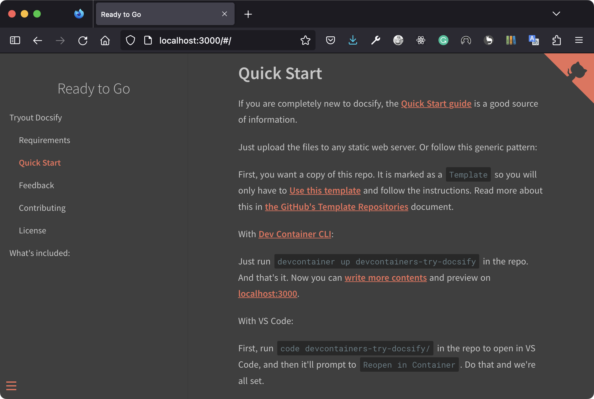

# Tryout Docsify

[][docsify-quick-start]

This template repo serves as a flavor of ready-to-go development container for use with [Dev Containers][devcontainers-overview].

> Originally, this dev container was created to tryout ready-to-go docsify template that requires no build steps.

[docsify-quick-start]: https://docsify.js.org/#/quickstart
[devcontainers-overview]: https://containers.dev/supporting#dev-containers

  

> The dead simple docsify template in action.

### What's included:

Technically, this includes nothing but:

- A simple template found in [@docsifyjs/docsify-template][docsify-template-repo] repo
- Configured to [preview locally](#quick-start), and
- Powered by [Docsify][docsify-js] and [Open Dev Containers][devcontainers-overview]

[docsify-template-repo]: https://github.com/docsifyjs/docsify-template
[docsify-js]: https://docsify.js.org/

## Requirements

See [dev containers][devcontainers-overview] to get started at the most basic level, and:
- A GitHub account, and
- A [Markdown][github-markdown-guides] editor, like [Typora][typora-install], a lightweight and easy-to-use syntax for all forms of writing on the GitHub platform

[github-markdown-guides]: https://guides.github.com/features/mastering-markdown/
[typora-install]: https://www.typora.io/

## Quick Start

If you are completely new to docsify, the [Quick Start guide][docsify-quick-start] is a good source of information.

Just upload the files to any static web server. Or follow this generic pattern:

First, you want a copy of this repo. It is marked as a `Template` so you will only have to [Use this template][use-this-template] and follow the instructions. Read more about this in [the GitHub's Template Repositories][github-template-repos-help] document.

[use-this-template]: https://github.com/alertbox/devcontainers-try-docsify/generate/
[github-template-repos-help]: https://help.github.com/en/github/creating-cloning-and-archiving-repositories/creating-a-repository-from-a-template

With [Dev Container CLI][devcontainer-cli-commands]:

Just run `devcontainer up devcontainers-try-docsify` in the repo. And that's it. Now you can [write more contents][docsify-write-more] and preview on [localhost:3000](http://localhost:3000).

[devcontainer-cli-commands]: https://github.com/devcontainers/cli#try-out-the-cli
[docsify-write-more]: https://docsify.js.org/#/more-pages

With VS Code:

First, run `code devcontainers-try-docsify/` in the repo to open in VS Code, and then it'll prompt to `Reopen in Container`. Do that and we're all set.

## Learning Resources

- [GitHub Learning Lab for GitHub Pages](https://lab.github.com/githubtraining/github-pages)
- [Mastering Markdown](https://guides.github.com/features/mastering-markdown/)
- [Create GitHub Pages with Docsify](https://www.youtube.com/watch?v=TV88lp7egMw)
- [Creating additional pages and content using Docsify](https://docsify.js.org/#/more-pages)

> [Awesome Lists](https://github.com/sindresorhus/awesome) are curated lists of awesome stuff. But, what is awesome?

[Awesome Docsify](https://github.com/docsifyjs/awesome-docsify/) | [GitHub Cheat Sheet](https://github.com/tiimgreen/github-cheat-sheet)

## Feedback

If you have any technical problems with Docsify, you are better off [asking Docsify Support directly][docsify-support], since you'll end up getting a much faster response back that way.

[docsify-support]: https://discord.gg/3NwKFyR

## Contributing

The official repo to contribute would be [@docsifyjs][docsify-github].

[docsify-github]: https://github.com/docsifyjs

## License

Copyright (c) Alertbox Inc. All rights reserved.

The source code is license under the [MIT License](LICENSE).
